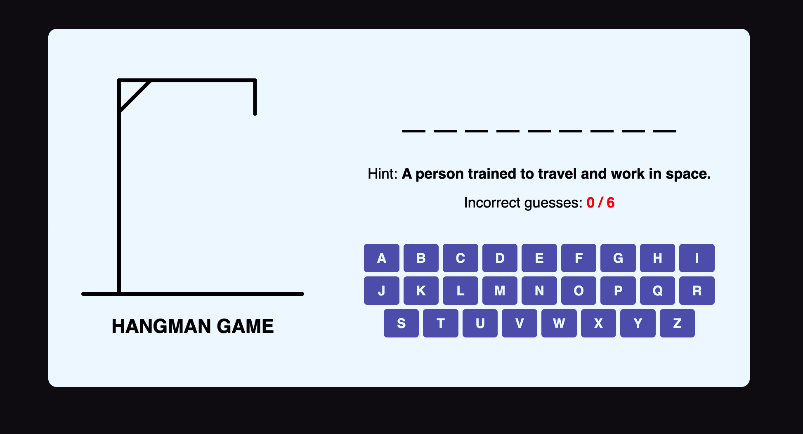
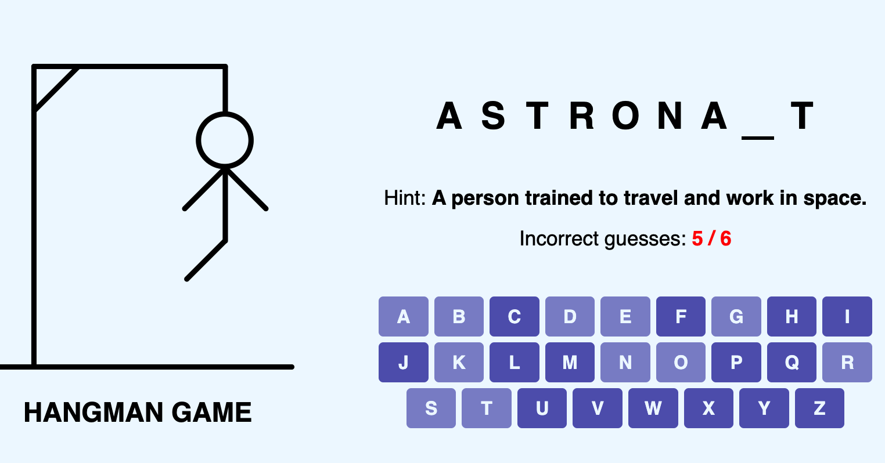
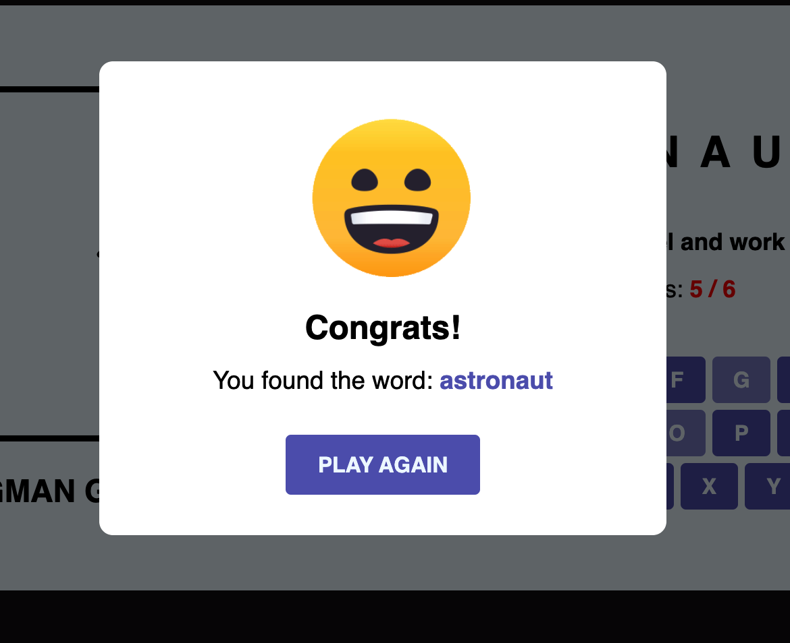

# 🕹️ Hangman Game (Vanilla JS)

This is a simple **Hangman game** built with **HTML, CSS, and JavaScript**. The player guesses the letters of a hidden word within a limited number of attempts. For every incorrect guess, a new part of the hangman is drawn. The game includes a dynamic keyboard, visual feedback, hints, and a result modal.

## 🚀 Features

- Random word and hint selection from a predefined list
- Fully interactive on-screen keyboard (A-Z)
- Visual hangman image that updates with each wrong guess
- Victory or loss modal with animated GIFs
- Hint system to help the player guess the word
- "Play Again" button to restart the game
- Responsive design for desktop and mobile screens

## 📂 Project Structure

```
├── index.html         # Main HTML structure
├── style.css          # Styling (responsive, modern layout)
├── script/
│   ├── script.js      # Core game logic
│   └── wordlist.js    # List of words and hints
└── images/            # Hangman images and victory/loss gifs
```

## 📌 How It Works

- A random word and its hint are selected at the start of each game.
- The player clicks on letter buttons to guess the word.
- Correct guesses reveal the letter in the word display.
- Incorrect guesses increase the hangman count (up to 6 tries).
- The game ends when:

  - The player successfully guesses all letters (win).
  - The player reaches 6 wrong guesses (lose).

- A modal shows the result and the correct word.

## 🖼️ Screenshots





## 🧠 Technologies Used

- HTML5
- CSS3 (Flexbox, Media Queries)
- JavaScript (DOM Manipulation, Events)

## 🧪 To Run the Game

Just open `index.html` in your browser — no setup needed!
